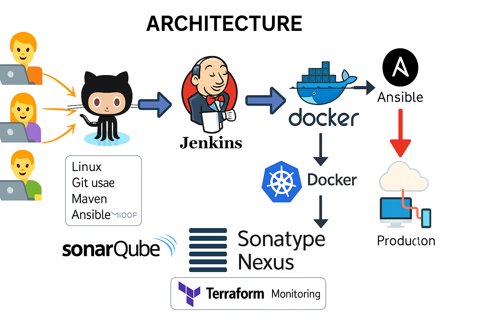

# 🚀 Bits and Builds – My DevOps Journey

Welcome to my DevOps learning repository!  
This repo contains my hands-on notes, class summaries, and tools I’m learning as I dive deep into the world of DevOps.

---

## 📁 Repository Structure

| Folder/File         | Description                                 |
|---------------------|---------------------------------------------|
| `linux_git_maven/`  | Basic Linux commands, Git usage, and Maven  |
| `docker/`           | Notes and examples related to Docker        |
| `jenkins/`          | Jenkins setup, pipelines, and automation    |
| `ansible/`          | Ansible playbooks, modules, and deployments |
| `k8s/`              | Kubernetes concepts, YAML files, and setup  |

---

## 🧭 DevOps Architecture Diagram

  
> *(Image shows GitHub + CI/CD Pipeline (Build, Test, SonarQube) + Docker + Kubernetes + Terraform + AWS + Prometheus + Grafana + ELK Stack)*

---

## ✨ What's Inside?
Each file contains:
- ✅ Clean and readable notes
- ✅ Real commands & examples
- ✅ Practical usage
- ✅ Interview-friendly tips

> This is a live repo and will keep growing as I learn.  
Feel free to fork or star if you're learning DevOps too!

---

## 📫 Let's Connect
Follow my DevOps blog: [Bits and Builds on Hashnode](https://hashnode.com/@yourname)
